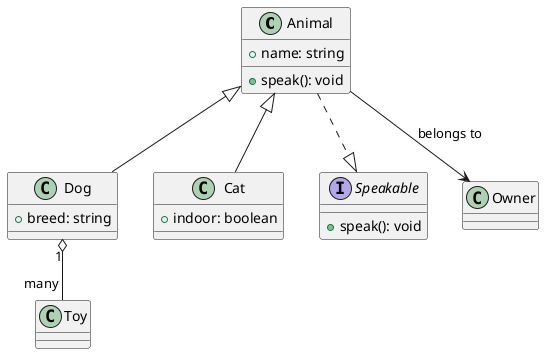
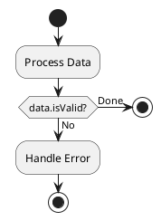

# UnderFlow

A modern flowchart editor built with React and Tauri.

## Features

- **Node Types** — Process, Input, Output, Condition (Diamond)
- **Inline Editing** — Double-click any node or edge label to edit
- **UML Class Diagram Edges** — Open Arrow, Filled Arrow, Hollow Triangle (Generalization), Hollow Diamond (Aggregation), Filled Diamond (Composition)
- **Line Styles** — Solid, Dashed, Dotted
- **Color System** — Hollow (border-only) and solid (filled) color presets with custom color picker
- **Border Styles** — Solid or dashed border options
- **Auto Layout** — One-click ELK-based layered graph layout
- **Export** — Export as SVG or PNG with native save dialog
- **Save/Open** — Save and load `.uflow` files (desktop app)
- **Auto Save** — Auto-saves every 60 seconds when file has been saved at least once
- **Keyboard Shortcuts** — Ctrl+S save, Ctrl+Shift+S save as
- **Background Settings** — Configurable dots, lines, or cross patterns with adjustable gap and size

## Tech Stack

| Layer | Technology |
|-------|-----------|
| Frontend | React 19 + TypeScript |
| Flow Engine | @xyflow/react 12 |
| Layout | ELK.js |
| Desktop | Tauri 2 |
| Build | Vite 8 |

## Project Structure

```
UnderFlow/
├── src/
│   ├── front/                  # React frontend
│   │   ├── src/
│   │   │   ├── components/
│   │   │   │   └── FlowchartApp/
│   │   │   │       └── index.tsx    # Main flowchart component
│   │   │   ├── lib/
│   │   │   │   └── tauri.ts         # Tauri IPC wrappers
│   │   │   ├── App.tsx
│   │   │   └── main.tsx
│   │   ├── package.json
│   │   └── vite.config.ts
│   └── tauri/                  # Tauri backend
│       ├── src/
│       │   └── main.rs         # Rust commands
│       ├── icons/              # App icons
│       ├── tauri.conf.json
│       └── Cargo.toml
├── README.md
└── createspace-DESIGN.md
```

## Getting Started

### Prerequisites

- [Node.js](https://nodejs.org/) >= 18
- [pnpm](https://pnpm.io/)
- [Rust](https://rustup.rs/)
- [Tauri Prerequisites](https://v2.tauri.app/start/prerequisites/)

### Development

```bash
# Install dependencies
cd src/front && pnpm install

# Start dev server (browser)
pnpm dev

# Start Tauri desktop app
pnpm tauri:dev
```

### Build

```bash
# Build desktop app
cd src/front && pnpm tauri:build
```

## .uflow File Format

UnderFlow uses `.uflow` as its native file extension. The file content is JSON with the following structure:

```json
{
  "nodes": [
    {
      "id": "1",
      "type": "input",
      "data": {
        "label": "Start",
        "color": "",
        "borderColor": "#334155",
        "borderStyle": "solid",
        "description": "Flow entry point"
      },
      "position": { "x": 250, "y": 5 }
    }
  ],
  "edges": [
    {
      "id": "e1-2",
      "source": "1",
      "target": "2",
      "type": "editable",
      "label": "next",
      "data": {
        "markerType": "open-arrow",
        "lineStyle": "solid"
      }
    }
  ]
}
```

### Node Types

| type | Shape | Description |
|------|-------|-------------|
| `input` | Rounded rectangle | Flow entry point |
| `default` | Rectangle | Process step |
| `condition` | Diamond | Decision/branch |
| `output` | Rounded rectangle | Flow exit point |

### Node Data Fields

| Field | Type | Description |
|-------|------|-------------|
| `label` | string | Display text |
| `color` | string | Fill color (empty = white) |
| `borderColor` | string | Border color |
| `borderStyle` | `"solid"` \| `"dashed"` | Border line style |
| `description` | string | Node description |
| `condition` | string | Condition expression (condition nodes only) |
| `yesLabel` | string | Label for "yes" branch (condition nodes only) |
| `noLabel` | string | Label for "no" branch (condition nodes only) |

### Edge Data Fields

| Field | Type | Description |
|-------|------|-------------|
| `markerType` | string | Arrow type (see below) |
| `lineStyle` | `"solid"` \| `"dashed"` \| `"dotted"` | Line pattern |

### Marker Types (UML Class Diagram)

| markerType | UML Meaning | Visual |
|------------|-------------|--------|
| `none` | No arrow | — |
| `open-arrow` | Association | Open arrowhead `>` |
| `filled-arrow` | Navigable Association | Filled arrowhead `▶` |
| `hollow-triangle` | Generalization / Inheritance | Hollow triangle `▷` |
| `hollow-diamond` | Aggregation | Hollow diamond `◇` |
| `filled-diamond` | Composition | Filled diamond `◆` |
| `hollow-diamond-arrow` | Aggregation + Association | `◇` at source, `>` at target |
| `filled-diamond-arrow` | Composition + Association | `◆` at source, `>` at target |

---

## AI MCP: PlantUML ↔ UnderFlow Conversion

This section describes how an AI agent (via MCP or direct integration) can convert between PlantUML class/activity diagrams and UnderFlow `.uflow` data. This enables round-trip editing: design in UnderFlow, serialize to PlantUML for documentation, or parse PlantUML into UnderFlow for visual editing.

### Conversion Rules

#### 1. Node Type Mapping

| PlantUML | UnderFlow node type |
|----------|-------------------|
| `start` / `stop` activity | `input` or `output` |
| `:activity;` | `default` |
| `if (...) then` / `else` / `endif` | `condition` |
| Class definition `class Foo` | `default` |
| Interface `interface IFoo` | `default` (with stereotype) |
| Abstract `abstract Foo` | `default` (with stereotype) |
| Enum `enum Foo` | `default` (with stereotype) |
| Actor / UseCase | `default` |

#### 2. Edge / Relationship Mapping

| PlantUML | UnderFlow markerType | lineStyle |
|----------|---------------------|-----------|
| `-->` (association) | `open-arrow` | `solid` |
| `->` (association, short) | `open-arrow` | `solid` |
| `--` (link, no arrow) | `none` | `solid` |
| `..>` (dependency) | `open-arrow` | `dashed` |
| `..` (link, dashed) | `none` | `dashed` |
| `--\|>` (generalization) | `hollow-triangle` | `solid` |
| `..\|>` (realization / interface implementation) | `hollow-triangle` | `dashed` |
| `o--` (aggregation) | `hollow-diamond-arrow` | `solid` |
| `*--` (composition) | `filled-diamond-arrow` | `solid` |
| `-->` with label | `open-arrow` + `label` | `solid` |

> **Note**: In PlantUML, `--` means vertical and `-` means horizontal. The direction does not affect UnderFlow conversion; only the arrow style and line style matter.

#### 3. Label Mapping

- PlantUML edge label (e.g., `A --> B : uses`) → UnderFlow `edge.label = "uses"`
- PlantUML class stereotype (e.g., `<<interface>>`) → UnderFlow `node.data.description = "<<interface>>"`
- PlantUML condition text (e.g., `if (value > 10?)`) → UnderFlow `node.data.condition = "value > 10?"`

#### 4. Position Calculation

PlantUML is text-based and auto-layouts. When converting PlantUML → UnderFlow:
- Use ELK.js auto-layout to compute `position` values
- Or assign positions top-to-bottom with a vertical gap of 100px and horizontal gap of 200px

When converting UnderFlow → PlantUML:
- Ignore `position` values entirely; PlantUML handles its own layout

### Example: PlantUML → UnderFlow

**Input (PlantUML):**



**Output (UnderFlow JSON):**

```json
{
  "nodes": [
    {
      "id": "1",
      "type": "default",
      "data": { "label": "Animal", "description": "+ name: string\n+ speak(): void" },
      "position": { "x": 200, "y": 0 }
    },
    {
      "id": "2",
      "type": "default",
      "data": { "label": "Dog", "description": "+ breed: string" },
      "position": { "x": 0, "y": 150 }
    },
    {
      "id": "3",
      "type": "default",
      "data": { "label": "Cat", "description": "+ indoor: boolean" },
      "position": { "x": 400, "y": 150 }
    },
    {
      "id": "4",
      "type": "default",
      "data": { "label": "Speakable", "description": "<<interface>>\n+ speak(): void" },
      "position": { "x": 600, "y": 0 }
    },
    {
      "id": "5",
      "type": "default",
      "data": { "label": "Toy" },
      "position": { "x": -200, "y": 300 }
    },
    {
      "id": "6",
      "type": "default",
      "data": { "label": "Owner" },
      "position": { "x": 600, "y": 150 }
    }
  ],
  "edges": [
    { "id": "e1-2", "source": "1", "target": "2", "type": "editable", "data": { "markerType": "hollow-triangle", "lineStyle": "solid" } },
    { "id": "e1-3", "source": "1", "target": "3", "type": "editable", "data": { "markerType": "hollow-triangle", "lineStyle": "solid" } },
    { "id": "e1-4", "source": "1", "target": "4", "type": "editable", "data": { "markerType": "hollow-triangle", "lineStyle": "dashed" } },
    { "id": "e2-5", "source": "2", "target": "5", "type": "editable", "label": "1..many", "data": { "markerType": "hollow-diamond-arrow", "lineStyle": "solid" } },
    { "id": "e1-6", "source": "1", "target": "6", "type": "editable", "label": "belongs to", "data": { "markerType": "open-arrow", "lineStyle": "solid" } }
  ]
}
```

### Example: UnderFlow → PlantUML

**Input (UnderFlow JSON):**

```json
{
  "nodes": [
    { "id": "1", "type": "input", "data": { "label": "Start" } },
    { "id": "2", "type": "default", "data": { "label": "Process Data" } },
    { "id": "3", "type": "condition", "data": { "label": "Valid?", "condition": "data.isValid" } },
    { "id": "4", "type": "default", "data": { "label": "Handle Error" } },
    { "id": "5", "type": "output", "data": { "label": "Done" } }
  ],
  "edges": [
    { "id": "e1-2", "source": "1", "target": "2", "data": { "markerType": "open-arrow", "lineStyle": "solid" } },
    { "id": "e2-3", "source": "2", "target": "3", "data": { "markerType": "open-arrow", "lineStyle": "solid" } },
    { "id": "e3-4", "source": "3", "target": "4", "label": "No", "data": { "markerType": "open-arrow", "lineStyle": "solid" } },
    { "id": "e3-5", "source": "3", "target": "5", "label": "Yes", "data": { "markerType": "open-arrow", "lineStyle": "solid" } }
  ]
}
```

**Output (PlantUML Activity Diagram):**



### Conversion Algorithm (Pseudocode)

```
# PlantUML → UnderFlow
function plantuml_to_uflow(plantuml_text):
    nodes = []
    edges = []
    id_counter = 0

    for each element in parse(plantuml_text):
        if element is class/interface/abstract/enum:
            node = {
                id: ++id_counter,
                type: "default",
                data: {
                    label: element.name,
                    description: element.stereotypes + element.members
                }
            }
            nodes.push(node)
            map element.name → node.id

        if element is relationship:
            edge = {
                id: "e" + source_id + "-" + target_id,
                source: map[element.source],
                target: map[element.target],
                type: "editable",
                label: element.label,
                data: {
                    markerType: map_arrow_type(element.arrow),
                    lineStyle: element.dashed ? "dashed" : "solid"
                }
            }
            edges.push(edge)

    # Auto-layout positions
    positions = elk_layout(nodes, edges)
    assign positions to nodes

    return { nodes, edges }


# UnderFlow → PlantUML
function uflow_to_plantuml(uflow_data):
    lines = ["@startuml"]

    for node in uflow_data.nodes:
        if node.type == "condition":
            lines.push(f"if ({node.data.condition}) then (Yes)")
        elif node.type == "input":
            lines.push("start")
        elif node.type == "output":
            lines.push("stop")
        else:
            lines.push(f":{node.data.label};")

    for edge in uflow_data.edges:
        arrow = map_to_plantuml_arrow(edge.data.markerType, edge.data.lineStyle)
        label_part = edge.label ? " : " + edge.label : ""
        lines.push(f"{edge.source} {arrow} {edge.target}{label_part}")

    lines.push("@enduml")
    return lines.join("\n")


# Arrow type mapping helpers
function map_arrow_type(plantuml_arrow):
    if arrow contains "<|" and not ".."  → "hollow-triangle"   # generalization
    if arrow contains "<|" and ".."      → "hollow-triangle"   # realization (dashed)
    if arrow contains "o--"              → "hollow-diamond-arrow"  # aggregation
    if arrow contains "*--"              → "filled-diamond-arrow"  # composition
    if arrow contains "-->"              → "open-arrow"       # association
    if arrow contains "--" no arrow      → "none"             # link only
    default                              → "open-arrow"

function map_to_plantuml_arrow(markerType, lineStyle):
    dash = lineStyle == "dashed" ? ".." : "--"
    if markerType == "hollow-triangle"       → dash + "|>"
    if markerType == "open-arrow"            → dash + ">"
    if markerType == "hollow-diamond-arrow"  → "o" + dash + ">"
    if markerType == "filled-diamond-arrow"  → "*" + dash + ">"
    if markerType == "none"                  → dash
    default                                  → dash + ">"
```

## License

MIT
