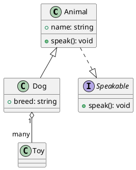
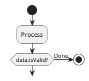

# UnderFlow — 现代流程图编辑器

## 一、软件简介

UnderFlow 是一款基于 Tauri 2 + React 19 构建的轻量级桌面流程图编辑器。它提供直观的拖拽式操作界面，支持多种节点类型、UML 类图连线、自动布局、颜色定制和多格式导出，适用于快速绘制流程图、架构图、UML 类图、工作流图等可视化文档。

**核心理念：** 用最少的操作步骤，画出最专业的流程图。

---

## 二、技术架构

```
┌─────────────────────────────────────────────────┐
│                  UnderFlow                       │
├──────────────────────┬──────────────────────────┤
│     Frontend (Web)   │     Backend (Rust)        │
├──────────────────────┼──────────────────────────┤
│  React 19            │  Tauri 2                  │
│  @xyflow/react 12    │  rfd (原生文件对话框)       │
│  ELK.js (自动布局)    │  serde_json               │
│  html-to-image       │  std::fs (文件读写)        │
│  Vite 8              │                           │
│  TypeScript 6        │                           │
├──────────────────────┴──────────────────────────┤
│              Tauri IPC (invoke)                  │
└─────────────────────────────────────────────────┘
```

### 前端层

| 技术 | 用途 |
|------|------|
| React 19 | UI 框架，函数组件 + Hooks |
| @xyflow/react 12 | 流程图核心引擎，提供节点/连线/画布/交互 |
| ELK.js | 基于 Eclipse Layout Kernel 的自动布局算法 |
| html-to-image | DOM 转 SVG/PNG 导出 |
| Vite 8 | 开发服务器与构建打包 |
| TypeScript 6 | 类型安全 |

### 后端层 (Rust)

| 模块 | 功能 |
|------|------|
| tauri 2 | 桌面应用框架，窗口管理，IPC 通信 |
| rfd 0.15 | 跨平台原生文件对话框（打开/保存） |
| std::fs | 文件系统读写 |

### IPC 通信

前端通过 `invoke()` 调用 Rust 命令：

| 命令 | 说明 |
|------|------|
| `save_flowchart` | 保存流程图数据到 .uflow 文件 |
| `load_flowchart` | 从 .uflow 文件加载流程图数据 |
| `save_file_dialog` | 弹出保存文件对话框（.uflow） |
| `open_file_dialog` | 弹出打开文件对话框（.uflow） |
| `save_image_dialog` | 弹出图片保存对话框 |
| `save_binary_file` | 保存二进制数据（PNG） |
| `save_text_file` | 保存文本数据（SVG） |

---

## 三、功能详解

### 3.1 节点类型

| 类型 | 形状 | 描述 |
|------|------|------|
| Input | 圆角矩形 | 流程起点 |
| Process | 矩形 | 通用处理步骤 |
| Condition | 菱形 | 条件判断，支持 Yes/No 分支 |
| Output | 圆角矩形 | 流程终点 |

### 3.2 颜色系统

每种节点支持三类颜色模式：

- **空心（Hollow）**：仅设置边框颜色，背景透明
- **实心（Solid）**：同时设置填充色和边框色
- **自定义**：通过色盘选择任意颜色

预设颜色：浅灰、玫瑰、珊瑚、琥珀、翠绿、青色、蓝色、紫色、粉色，以及默认黑边框。

### 3.3 边框样式

- Solid（实线）
- Dashed（虚线）

### 3.4 连线与箭头

UnderFlow 支持标准 UML 类图连线类型：

| 箭头类型 | UML 含义 | 视觉 |
|----------|----------|------|
| None | 无箭头 | — |
| Open Arrow | 关联（Association） | 开放箭头 `>` |
| Filled Arrow | 导航关联（Navigable） | 实心箭头 `▶` |
| Hollow Triangle | 泛化/继承（Generalization） | 空心三角 `▷` |
| Hollow Diamond | 聚合（Aggregation） | 空心菱形 `◇` |
| Filled Diamond | 组合（Composition） | 实心菱形 `◆` |
| Hollow Diamond + Arrow | 聚合 + 关联 | 源端 `◇`，目标端 `>` |
| Filled Diamond + Arrow | 组合 + 关联 | 源端 `◆`，目标端 `>` |

连线线型支持：
- Solid（实线）
- Dashed（虚线）
- Dotted（点线）

其他连线特性：
- Bezier 曲线连线
- 双击编辑连线标签
- 拖拽重连（Reconnect）

### 3.5 自动布局

基于 ELK.js 的分层布局算法：
- 算法：Layered（分层）
- 方向：自上而下
- 自动计算节点间距和层级间距
- 一键布局，自动适配视图

### 3.6 导出

| 格式 | 方式 | 说明 |
|------|------|------|
| SVG | 矢量导出 | 无损缩放，适合文档嵌入 |
| PNG | 位图导出 | 3x 像素密度，高清输出 |

导出时自动隐藏工具栏、缩略图、控件，仅保留画布内容（节点 + 连线 + 背景）。

### 3.7 背景设置

| 模式 | 说明 |
|------|------|
| Dots | 圆点网格 |
| Lines | 线条网格 |
| Cross | 十字网格 |
| None | 无背景 |

支持自定义间距（10-60px）和大小（0.5-3）。

### 3.8 文件管理

- **文件格式**：`.uflow`（JSON 格式）
- **保存**（Ctrl+S）：保存到当前文件，未保存过则弹出对话框
- **另存为**（Ctrl+Shift+S）：弹出对话框保存到新位置，保存后切换到新文件
- **打开**：从 .uflow 文件加载流程图
- **自动保存**：每 60 秒自动保存（需已保存过至少一次）
- **窗口标题**：显示文件名和保存状态
  - 未保存：`未命名 (未保存) - UnderFlow`
  - 已保存：`文件名 (已保存 HH:MM:SS) - UnderFlow`

### 3.9 键盘快捷键

| 快捷键 | 功能 |
|--------|------|
| Ctrl+S | 保存 |
| Ctrl+Shift+S | 另存为 |
| Delete | 删除选中元素 |

---

## 四、.uflow 文件格式

UnderFlow 使用 `.uflow` 作为原生文件扩展名，文件内容为 JSON 格式：

```json
{
  "nodes": [
    {
      "id": "1",
      "type": "input",
      "data": {
        "label": "Start",
        "color": "",
        "borderColor": "#334155",
        "borderStyle": "solid",
        "description": "Flow entry point"
      },
      "position": { "x": 250, "y": 5 }
    }
  ],
  "edges": [
    {
      "id": "e1-2",
      "source": "1",
      "target": "2",
      "type": "editable",
      "label": "next",
      "data": {
        "markerType": "open-arrow",
        "lineStyle": "solid"
      }
    }
  ]
}
```

### 节点数据字段

| 字段 | 类型 | 说明 |
|------|------|------|
| `label` | string | 显示文本 |
| `color` | string | 填充色（空 = 白色） |
| `borderColor` | string | 边框颜色 |
| `borderStyle` | `"solid"` \| `"dashed"` | 边框线型 |
| `description` | string | 节点描述 |
| `condition` | string | 条件表达式（仅条件节点） |
| `yesLabel` | string | Yes 分支标签（仅条件节点） |
| `noLabel` | string | No 分支标签（仅条件节点） |

### 连线数据字段

| 字段 | 类型 | 说明 |
|------|------|------|
| `markerType` | string | 箭头类型（见 3.4 节） |
| `lineStyle` | `"solid"` \| `"dashed"` \| `"dotted"` | 线型 |

---

## 五、AI MCP：PlantUML ↔ UnderFlow 互转

UnderFlow 支持与 PlantUML 双向数据转换，AI 可通过 MCP 或直接集成实现：
- 在 UnderFlow 中设计 → 序列化为 PlantUML 用于文档
- 解析 PlantUML → 导入 UnderFlow 进行可视化编辑

### 节点类型映射

| PlantUML | UnderFlow |
|----------|-----------|
| `start` / `stop` | `input` / `output` |
| `:activity;` | `default` |
| `if (...) then` | `condition` |
| `class Foo` | `default` |
| `interface IFoo` | `default`（带 stereotype） |
| `abstract Foo` | `default`（带 stereotype） |

### 连线映射

| PlantUML | UnderFlow markerType | lineStyle |
|----------|---------------------|-----------|
| `-->` | `open-arrow` | `solid` |
| `--` | `none` | `solid` |
| `..>` | `open-arrow` | `dashed` |
| `--\|>` | `hollow-triangle` | `solid` |
| `..\|>` | `hollow-triangle` | `dashed` |
| `o--` | `hollow-diamond-arrow` | `solid` |
| `*--` | `filled-diamond-arrow` | `solid` |

### 标签映射

- PlantUML 边标签 `A --> B : uses` → `edge.label = "uses"`
- PlantUML stereotype `<<interface>>` → `node.data.description`
- PlantUML 条件 `if (value > 10?)` → `node.data.condition`

### 示例：PlantUML → UnderFlow



转换为 UnderFlow JSON：

```json
{
  "nodes": [
    { "id": "1", "type": "default", "data": { "label": "Animal", "description": "+ name: string\n+ speak(): void" } },
    { "id": "2", "type": "default", "data": { "label": "Dog", "description": "+ breed: string" } },
    { "id": "3", "type": "default", "data": { "label": "Speakable", "description": "<<interface>>\n+ speak(): void" } },
    { "id": "4", "type": "default", "data": { "label": "Toy" } }
  ],
  "edges": [
    { "id": "e1-2", "source": "1", "target": "2", "type": "editable", "data": { "markerType": "hollow-triangle", "lineStyle": "solid" } },
    { "id": "e1-3", "source": "1", "target": "3", "type": "editable", "data": { "markerType": "hollow-triangle", "lineStyle": "dashed" } },
    { "id": "e2-4", "source": "2", "target": "4", "type": "editable", "label": "1..many", "data": { "markerType": "hollow-diamond-arrow", "lineStyle": "solid" } }
  ]
}
```

### 示例：UnderFlow → PlantUML

```json
{
  "nodes": [
    { "id": "1", "type": "input", "data": { "label": "Start" } },
    { "id": "2", "type": "default", "data": { "label": "Process" } },
    { "id": "3", "type": "condition", "data": { "label": "Valid?", "condition": "data.isValid" } },
    { "id": "4", "type": "output", "data": { "label": "Done" } }
  ],
  "edges": [
    { "id": "e1-2", "source": "1", "target": "2", "data": { "markerType": "open-arrow", "lineStyle": "solid" } },
    { "id": "e2-3", "source": "2", "target": "3", "data": { "markerType": "open-arrow", "lineStyle": "solid" } },
    { "id": "e3-4", "source": "3", "target": "4", "label": "Yes", "data": { "markerType": "open-arrow", "lineStyle": "solid" } }
  ]
}
```

转换为 PlantUML：



---

## 六、适用场景

### 6.1 软件开发

- 业务流程梳理
- API 调用链路图
- 微服务架构图
- UML 类图设计
- CI/CD 流水线设计

### 6.2 产品设计

- 用户操作流程
- 功能模块关系图
- 信息架构图

### 6.3 教育培训

- 算法流程演示
- 知识结构图
- 课程大纲可视化

### 6.4 项目管理

- 项目进度流程
- 审批流程设计
- 组织架构图

---

## 七、与同类工具对比

| 特性 | UnderFlow | Draw.io | Lucidchart | Mermaid |
|------|-----------|---------|------------|---------|
| **部署方式** | 桌面应用 | Web/桌面 | Web | 代码生成 |
| **开源** | MIT | Apache 2.0 | 否 | MIT |
| **离线使用** | ✅ 完全离线 | ✅ 可离线 | ❌ 需联网 | ✅ |
| **自动布局** | ✅ ELK.js | ❌ | ❌ | ❌ |
| **UML 连线** | ✅ 8 种箭头 | ✅ | ✅ | ✅ |
| **原生文件对话框** | ✅ | ❌ | ❌ | N/A |
| **导出 SVG** | ✅ | ✅ | ✅ | ✅ |
| **导出 PNG** | ✅ | ✅ | ✅ | ❌ |
| **自动保存** | ✅ 60s | ✅ | ✅ | N/A |
| **PlantUML 互转** | ✅ | ❌ | ❌ | ✅ |
| **内联编辑** | ✅ 双击编辑 | ✅ | ✅ | ❌ |
| **启动速度** | < 1s | 2-3s | 5s+ | N/A |
| **安装包大小** | ~5MB | ~150MB | N/A | 0 |
| **内存占用** | ~30MB | ~200MB | ~100MB | N/A |

### UnderFlow 的优势

1. **极致轻量**：安装包约 5MB，运行内存约 30MB，启动秒开
2. **完全离线**：无需网络，数据不上传，隐私安全
3. **原生体验**：系统文件对话框，与操作系统深度集成
4. **一键布局**：ELK 自动布局算法，告别手动排列
5. **UML 标准连线**：支持关联、泛化、聚合、组合等标准箭头
6. **AI 友好**：.uflow JSON 格式 + PlantUML 互转规则，便于 AI MCP 集成
7. **MIT 开源**：可自由使用、修改和分发

### UnderFlow 的不足

1. 目前仅支持 Windows，macOS/Linux 待适配
2. 不支持多人协作编辑
3. 不支持云端存储
4. 节点类型相对有限

---

## 八、快速开始

### 环境要求

- Node.js >= 18
- pnpm
- Rust (rustup)
- Tauri 系统依赖

### 开发

```bash
cd src/front
pnpm install
pnpm tauri:dev
```

### 构建

```bash
cd src/front
pnpm tauri:build
```

产物位于 `src/front/src-tauri/target/release/bundle/`。

---

## 九、项目结构

```
UnderFlow/
├── src/
│   ├── front/                          # 前端
│   │   ├── src/
│   │   │   ├── components/
│   │   │   │   └── FlowchartApp/
│   │   │   │       └── index.tsx       # 核心组件
│   │   │   ├── lib/
│   │   │   │   └── tauri.ts            # Tauri IPC 封装
│   │   │   ├── App.tsx
│   │   │   └── main.tsx
│   │   ├── package.json
│   │   └── vite.config.ts
│   └── tauri/                          # 后端
│       ├── src/
│       │   └── main.rs                 # Rust 命令
│       ├── icons/                      # 应用图标
│       ├── tauri.conf.json
│       └── Cargo.toml
├── docs/
│   └── introduction.md
├── README.md
└── createspace-DESIGN.md
```

---

## 十、许可证

MIT License. 自由使用、修改和分发。
